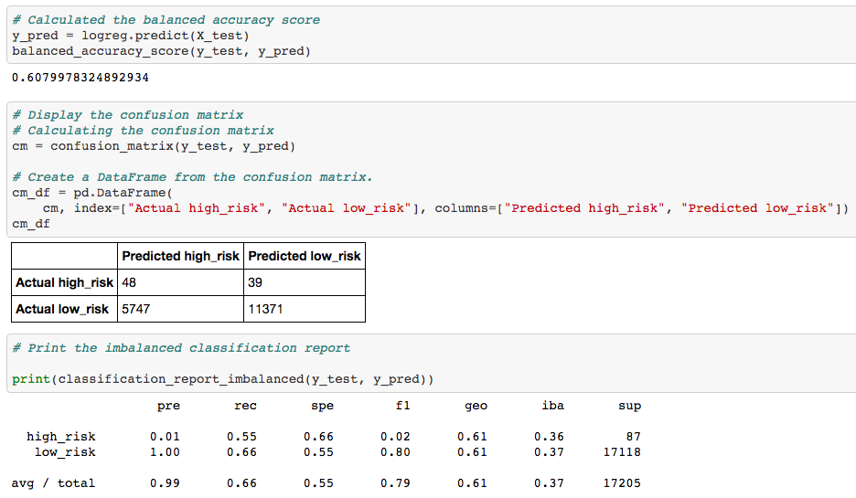
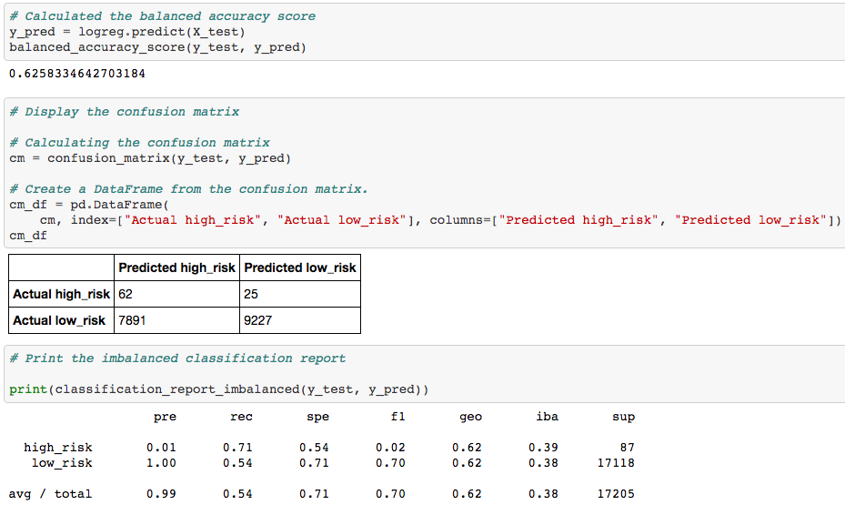

# Credit_Risk_Analysis

## Table of Contents
* [Project title](#project-title)
* [Technologies](#technologies)
* [Overview](#overview)
* [Results](#results)
* [Summary](#summary)

## Project title
Credit Risk Analysis

## Technologies
[Python](https://www.python.org/downloads/ "Download Python") 3.7.9.

## Overview 
Credit risk is an inherently unbalanced classification problem, as good loans easily outnumber risky loans. For this project, I applied machine learning to solve a real-world challenge: credit card risk. I employed different techniques to train and evaluate models with unbalanced classes:
* oversample the data using the RandomOverSampler and SMOTE algorithms;
* undersample the data using the ClusterCentroids algorithm;
* a combinatorial approach of over- and undersampling using the SMOTEENN algorithm;
* then, compare two new machine learning models that reduce bias, BalancedRandomForestClassifier and EasyEnsembleClassifier, to predict credit risk. 

After evaluating the performance of these models and I was able to make a written recommendation on whether they should be used to predict credit risk.

## Results

### Oversampling
#### Naive Random Oversampling

The accuracy score for the random oversampling is 0.65. The precision for high_risk is 0.01, very low and high for the low risk, indicating an overfitting for the low_risk. The recall (sensitivity) for both cases are not ideal.

#### SMOTE Oversampling

The accuracy score for the SMOTE oversampling is 0.61. The precision for high_risk is 0.01, very low and high for the low risk, indicating an overfitting for the low_risk. The recall (sensitivity) for both cases are not ideal and lower than the Naive Random Oversampling.

#### Undersampling

The accuracy score for the random oversampling is 0.51.The precision for high_risk is 0.01, very low and high for the low risk, indicating an overfitting for the low_risk. The recall (sensitivity) for both cases are not good.

#### Combination (Over and Under) Sampling

The accuracy score for the random oversampling is 0.6. The precision for high_risk is 0.01, very low and high for the low risk, indicating an overfitting for the low_risk. The recall (sensitivity) for both cases are not good.

## Summary
In the first four models we undersampled, oversampled and did a combination of both to try and determine which model is best at predicting which loans are the highest risk. The next two models we resampled the data using ensemble classifiers to try and predict which which loans are high or low risk. In our first four models our accuracy score is not as high as the ensemble classifiers and the recall in the oversampling/undersampling/mixed models is low as well. Typically in your models you want a good balance of recall and precision which is why I recommend the ensemble classifiers over the first four models. It appears that the Easy Ensemble had the best balance of all the models because of it's high accuracy score and good balance of precision and recall scores.
